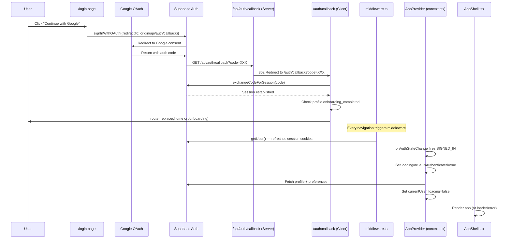

# Auth Flow Diagnosis: Infinite Loader / Null User After Successful Login

## The Full Auth Chain



---

## The Loading / Rendering Decision Tree in AppShell

```
AppShell receives: { loading, isAuthenticated, currentUser, isOnboarded }

1. shouldShowLoader = loading && (!isPublicRoute || pathname === '/onboarding')
   → TRUE  → Show "Stamping your taste..." spinner
   → FALSE → continue ↓

2. isSyncFailure = isAuthenticated && !currentUser && !loading && !isPublicRoute
   → TRUE  → Show "Stamping Connection Error" panel
   → FALSE → continue ↓

3. noShell = !isAuthenticated || [public routes]
   → TRUE  → Render bare {children}
   → FALSE → Render full nav shell + {children}
```

---

## Identified Failure Branches

### 🔴 Bug 1: `INITIAL_SESSION` with valid cookies is silently ignored

**Location**: [context.tsx:528-549](file:///e:/recd-app/src/lib/context.tsx#L528-L549)

**What happens**: When a user has a valid session cookie (e.g. returning to the site, or after a page refresh post-login), `onAuthStateChange` fires `INITIAL_SESSION` with a valid `session`. This correctly enters the profile-fetch branch at line 552. **However**, if the `INITIAL_SESSION` fires with `session = null` (which happens when cookies aren't ready yet), the code at line 542-548 sets `loading: false` but leaves `currentUser: null` and `isAuthenticated: false`.

**The problem**: The middleware refreshes the session cookies, but there's a race condition. If `INITIAL_SESSION` fires **before** the middleware has written updated cookies to the response, the browser Supabase client sees no session. The code correctly avoids treating this as a logout, but it sets `loading: false` prematurely. If a subsequent `TOKEN_REFRESHED` or `SIGNED_IN` event fires later, it re-enters the profile fetch — **but if no subsequent event fires**, the user is stuck with:
- `loading: false`
- `isAuthenticated: false`  
- `currentUser: null`

**Result**: The user sees the landing page or gets redirected to `/` by the AppShell redirect logic at line 52 (after the 2-second hydration buffer).

> [!CAUTION]
> This is the **most likely cause of the infinite loader on production** for returning users. The `INITIAL_SESSION` with no session sets `loading: false` too early, and no follow-up event arrives to trigger profile fetch.

---

### 🔴 Bug 2: `onAuthStateChange` sets `loading: true` on every auth event, even during navigation

**Location**: [context.tsx:552-558](file:///e:/recd-app/src/lib/context.tsx#L552-L558)

**What happens**: Every time `onAuthStateChange` fires with a valid session (including `TOKEN_REFRESHED`, `SIGNED_IN`, `INITIAL_SESSION`), it unconditionally sets `loading: true` and `isAuthenticated: true`. This triggers the AppShell loader on **every navigation** if the middleware triggers a token refresh.

**The problem**: If the profile fetch in the `try` block (lines 560-700) takes time or fails silently (e.g. a network hiccup), `loading` stays `true` until either:
- The profile fetch completes (sets `loading: false` at line 675/696)
- The catch block runs (sets `loading: false` at line 708)
- The 25-second safety timeout fires (line 714-725)

If the profile fetch throws an error that is NOT a JWT/unauthorized error, the catch at line 701 sets `loading: false` but **does NOT set currentUser**. This leaves the state at:
- `loading: false`
- `isAuthenticated: true`
- `currentUser: null`

**Result**: → `isSyncFailure` becomes `true` → **"Stamping Connection Error" panel** is shown.

> [!WARNING]
> This is the exact branch that triggers the Connection Error screen. Any transient Supabase error (RLS policy failure, network timeout, rate limit) during the profile fetch will produce this state.

---

### 🟡 Bug 3: Middleware intercepts the OAuth callback itself

**Location**: [middleware.ts:54-66](file:///e:/recd-app/src/middleware.ts#L54-L66)

**What happens**: The middleware matcher comment says it should exclude `api/auth/callback`, but the actual regex pattern is:
```
'/((?!_next/static|_next/image|favicon.ico|.*\\.(?:svg|png|jpg|jpeg|gif|webp)$).*)'
```

This pattern **does NOT exclude** `/api/auth/callback`. The middleware runs on the callback route.

**The problem**: The middleware calls `supabase.auth.getUser()` which tries to read/refresh session cookies. During the initial callback, there are **no session cookies yet** (the code hasn't been exchanged). The middleware's `getUser()` call silently fails and continues. This is mostly harmless because the API route just does a redirect — but it adds unnecessary latency and could interfere with cookie state in edge cases.

**However**, the middleware also runs on `/auth/callback` (the client-side exchange page). Here, `getUser()` might attempt to refresh a session that doesn't exist yet, potentially writing confusing cookie state before `exchangeCodeForSession` runs.

> [!NOTE]
> This is likely benign on most requests, but adds latency and could theoretically cause a cookie conflict on the client-side callback page.

---

### 🟡 Bug 4: `NEXT_PUBLIC_APP_URL` is hardcoded to `localhost:3000` — production redirect mismatch

**Location**: [.env.local:4](file:///e:/recd-app/.env.local#L4)

**What happens**: The `.env.local` file has:
```
NEXT_PUBLIC_APP_URL=http://localhost:3000
```

This variable is used in the `inviteLink` template in [context.tsx:166](file:///e:/recd-app/src/lib/context.tsx#L166). The `login()` function at [context.tsx:786](file:///e:/recd-app/src/lib/context.tsx#L786) correctly uses `window.location.origin` instead, so the OAuth redirect URL itself is correct.

**The problem**: If Vercel is deployed **without** `NEXT_PUBLIC_APP_URL` set as an environment variable, invite links will contain `http://localhost:3000`. This won't break auth, but it's a production data bug for invite URLs. The `actions.ts` file at [line 353-363](file:///e:/recd-app/src/lib/supabase/actions.ts#L353-L363) has a fallback to `https://recd-app.vercel.app` when headers fail, but the context.tsx invite link template doesn't.

> [!IMPORTANT]
> Verify that `NEXT_PUBLIC_APP_URL` is set correctly in your Vercel environment variables. If it's missing, invite links generated on the client side will point to `localhost:3000`.

---

### 🟡 Bug 5: `refreshData` dependency on `state.currentUser` via stale closure

**Location**: [context.tsx:204-205](file:///e:/recd-app/src/lib/context.tsx#L204-L205)

**What happens**: `refreshData` is defined with `useCallback(async (overrideUserId?) => { ... }, [])` — the dependency array is **empty**. Inside, it reads `state.currentUser?.id` as a fallback. Because the dependency array is empty, this closure captures the **initial** state where `currentUser` is `null`.

**The problem**: When `refreshData()` is called **without** an `overrideUserId` argument (e.g. from `handleRetry` in AppShell at [line 81](file:///e:/recd-app/src/components/AppShell.tsx#L81), or from `sendCrewRequest`/`acceptCrewRequest` callbacks), it falls back to `state.currentUser?.id` — which is **always null** due to the stale closure. The recovery mode at line 209-213 mitigates this by calling `supabase.auth.getSession()`, but it adds an extra network round-trip.

The `onAuthStateChange` handler at [line 680](file:///e:/recd-app/src/lib/context.tsx#L680) correctly passes `session.user.id` directly, so the initial hydration works fine. It's only subsequent `refreshData()` calls (without an argument) that hit this stale closure.

> [!NOTE]
> The recovery mode at lines 209-213 masks this bug for most cases, but it adds unnecessary latency. The "Retry Connection" button in AppShell will trigger this recovery path every time.

---

## Summary Table

| # | Bug | Severity | Symptom | State Left Behind |
|---|-----|----------|---------|-------------------|
| 1 | `INITIAL_SESSION` with no session sets `loading: false` prematurely, no follow-up event | 🔴 Critical | User sent to `/` or sees blank page | `loading:false, isAuth:false, user:null` |
| 2 | Profile fetch error leaves `isAuthenticated: true` but `currentUser: null` | 🔴 Critical | "Stamping Connection Error" panel | `loading:false, isAuth:true, user:null` |
| 3 | Middleware runs on auth callback routes unnecessarily | 🟡 Medium | Extra latency, potential cookie conflict | N/A |
| 4 | `NEXT_PUBLIC_APP_URL` is `localhost:3000` in `.env.local` | 🟡 Medium | Broken invite links in production | N/A |
| 5 | `refreshData` stale closure on `state.currentUser` | 🟡 Medium | Extra round-trip on retry, hidden by recovery mode | N/A |

---

## Root Cause Conclusion

**The primary culprit for the infinite loader / null user after a successful Google OAuth session is Bug 1 + Bug 2 combined:**

1. User completes Google OAuth successfully
2. Browser navigates to `/auth/callback` → exchanges code → session is established → redirects to `/home` or `/onboarding`
3. On the target page, `AppProvider` mounts and `onAuthStateChange` fires
4. **If `INITIAL_SESSION` fires with `session=null`** (race with middleware cookie write): `loading` is set to `false` with no user — user gets bounced to `/` or sees blank page
5. **If `INITIAL_SESSION` fires with a valid session** but the subsequent profile fetch errors out (RLS, network, cold-start): `loading` is set to `false`, `isAuthenticated` stays `true`, `currentUser` stays `null` — user sees "Stamping Connection Error"

The 25-second safety timeout is the last resort that prevents a truly infinite spinner, but it just transitions from the spinner to the Connection Error panel.

---

## Questions Before Implementing Fixes

1. **Are you seeing the "Stamping Connection Error" panel** (Bug 2 path) or a **redirect back to the landing page** (Bug 1 path) after login? This determines which fix to prioritize.
2. **Is `NEXT_PUBLIC_APP_URL` set in your Vercel project environment variables?** If so, what is its value?
3. **What is the Supabase Auth redirect URL** configured in your Supabase Dashboard → Authentication → URL Configuration → Redirect URLs? It needs to include your production domain's `/api/auth/callback` path.
